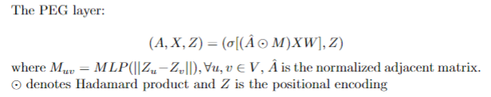

# PEG
The official implementation of PEG for our paper: Equivariant and Stable Positional Encoding for More Powerful Graph Neural Networks. (https://openreview.net/pdf?id=e95i1IHcWj)

## Introduction
In this work we propose a principled way of using PE to build more powerful GNNs. The key idea is to use separate channels to update the original node features and positional features. The GNN architecture keeps not only permutation equivariant w.r.t. node features but also rotation equivariant w.r.t. positional features. This idea applies to a broad range of PE techniques that can be formulated as matrix factorization such as Laplacian Eigenmap (LE and Deepwalk). We design a GNN layer PEG that satisfies such requirements. Figure 1 shows the architecture of PEG.

<p align="center"></p>
<p align="center"><em>Figure 1.</em> The PEG layer.</p>


## Requirements ##
(Other versions may work, but are untested)
0. Python 3.7
1. PyTorch 1.8.1 Cuda 10.2
2. NetworkX 2.6.2
3. dgl 0.6.1
4. Numpy 1.20.3
5. Scipy 1.6.2
6. Scikit-Learn 0.24.1
7. Tensorflow 2.6.0
8. torch-geometric 1.7.2

## PEG Environment Setup ##
- Install basic dependencies to virtual environment and activate it: 
```bash
conda env create -f environment.yml
conda activate PEG_env
```

- Example commends of installation for PyTorch (>= 1.8.0) and torch-geometric (>=1.7.2) with CUDA 10.2:
```bash
conda install pytorch==1.8.0 torchvision torchaudio cudatoolkit=10.2
pip install torch-scatter -f https://pytorch-geometric.com/whl/torch-1.8.0+cu102.html
pip install torch-sparse -f https://pytorch-geometric.com/whl/torch-1.8.0+cu102.html
pip install torch-cluster -f https://pytorch-geometric.com/whl/torch-1.8.0+cu102.html
pip install torch-spline-conv -f https://pytorch-geometric.com/whl/torch-1.8.0+cu102.html
pip install torch-geometric==1.7.2
```
For more details, please refer to the [PyTorch](https://pytorch.org/) and [PyTorch Geometric](https://pytorch-geometric.readthedocs.io/en/1.6.3/notes/installation.html). The code of this repository is lately tested with Python 3.7.11 + PyTorch 1.8.1 + torch-geometric 1.7.2.

#### Run Examples
In Task 1, the model gets trained, validated and tested over the same graphs while using different link sets. In Task 2, the graph used for training/validation is different from the one used for testing. Both tasks may reflect the effectiveness of a model while Task 2 may better demonstrate the model's generalization capability that strongly depends on permutation equivariance and stability.
##### Task1
```bash
cd task1
```
PEG-DW using node feature on cora
```bash
python main.py --PE_method DW --dataset cora --feature_type N
```
PEG-LE+ using constant feature on cora
```bash
python main.py --PE_method LE --dataset cora --feature_type C --random_partition
```

For ogbl-ddi and ogbl-collab
```bash
cd OGB
```

##### Task2
```bash
cd task2
```
PEG-DW using node feature on cora->citeseer
```bash
python main.py --PE_method DW --source_dataset cora --target_dataset citeseer --feature_type N
```
PEG-LE+ using constant feature on cora->citeseer
```bash
python main.py --PE_method LE --source_dataset cora --target_dataset citeseer --feature_type C --random_partition
```
For PPI dataset
```bash
python PPI.py --PE_method LE --feature_type N
```
## Usage Summary
```
usage: main.py [-h] [--device DEVICE]
               [--dataset {cora,citeseer,pubmed,PTBR,RU,ENGB,ES,chameleon}]
               [--PE_method {DW,LE}] [--feature_type {N,C}]
               [--num_layers NUM_LAYERS] [--PE_dim PE_DIM]
               [--hidden_dim HIDDEN_DIM] [--batch_size BATCH_SIZE] [--lr LR]
               [--weight_decay WEIGHT_DECAY] [--epochs EPOCHS]
               [--val_ratio VAL_RATIO] [--test_ratio TEST_RATIO]
               [--random_partition]

```

## Optional Arguments
```
optional arguments:
  -h, --help            show this help message and exit
  --device DEVICE
  --dataset {cora,citeseer,pubmed,PTBR,RU,ENGB,ES,chameleon}
                        dataset name
  --PE_method {DW,LE}   positional encoding techniques
  --feature_type {N,C}  features type, N means node feature, C means constant
                        feature (node degree)
  --num_layers NUM_LAYERS
                        number of layers
  --PE_dim PE_DIM       dimension of positional encoding
  --hidden_dim HIDDEN_DIM
                        hidden dimension
  --batch_size BATCH_SIZE
                        batch size
  --lr LR               learning rate
  --weight_decay WEIGHT_DECAY
                        weight decay
  --epochs EPOCHS       number of epochs to train
  --val_ratio VAL_RATIO
                        validation ratio
  --test_ratio TEST_RATIO
                        testing ratio
  --random_partition    whether to use random partition while training
```

## Citation
Please refer to our paper. Haorui Wang, Haoteng Yin, Muhan Zhang, Pan Li. [Equivariant and Stable Positional Encoding for More Powerful Graph Neural Networks](https://openreview.net/pdf?id=e95i1IHcWj). In *International Conference on Learning Representations (ICLR)*, 2022

  @inproceedings{wang2021equivariant,
  title={Equivariant and Stable Positional Encoding for More Powerful Graph Neural Networks},
  author={Wang, Haorui and Yin, Haoteng and Zhang, Muhan and Li, Pan},
  booktitle={International Conference on Learning Representations},
  year={2022}
}
